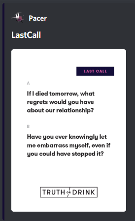

# Card-bot

Card bot was a fun project that I developed to play with my friends during quarantine.
Initially was had a whole deck of cards from Truth or Drink and no way to draw them, so I made a bot to do it for us 
with a few quality of life features.

The goals were:
 - For the bot to be able to shuffle the decks specified
 - To be able to pick a person to direct that card at
 - Pick a card at random
 
 And later we added some moderator features for the discord sever 


## Screenshots
### Card


## Installation

Use the package manager [npm](https://www.npmjs.com/) to install dependencies.

```bash
npm install
```

## Build Setup

``` bash
First you need to add a .env with the KEY field and your bot key

# start the bot with
npm run start
